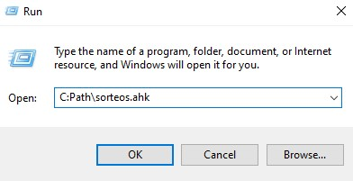

# Bot para comentarios de Instagram
    Bot hecho con Autohotkey para comentar y participar en sorteos que pidan mencionar gente

### Requsitos
- Autohotkey
- Configurar cuentas.txt y chances.txt
- **(Opcional)** Cambiar mensajes y emojis al final del [Código del Script](./sorteos.ahk) 

```bash
# Crear ambos archivos
touch cuentas.txt
touch chances.txt
```

En el archivo cuentas hay que poner el listado de cuentas que el bot puede mencionar (una cuenta por línea)
```bash
# Ejemplo de como se ve cuentas.txt
@Cuenta1
@Cuenta2
@Cuenta3
...
@CuentaN
```
El archivo chances.txt lo creas pero lo dejas vacío (El script lo va a ir modificando)

### ¿Cómo usar?
1) Tenes que ya tener iniciada su sesión de instagram en la cuenta que vas a usar (Desde el navegador de una compu)
2) Vas a la publicación donde vas a comentar y la abris

    Deberia quedarte asi:
    
3) Ahora hace click donde comentas como para empezar a escribir y ya podes ejecutar el Script
    ```bash
    # Ejecutar por comando Win+R 
    C:Path\sorteos.ahk

    # Reemplaza path por la ruta hasta donde tener el archivo sorteos.ahk
    # Por ejemplo el comando puede quedar algo asi:
    C:ejemplo\usuario\Desktop\bot-comentarios-instagram\sorteos.ahk

    # Lo pegas en la ventana de run y ejecutas
    ```
    

⚠ Si queres mencionar más de una cuenta por comentario poder modificar las variables de Config dentro del [Script](./sorteos.ahk) 

